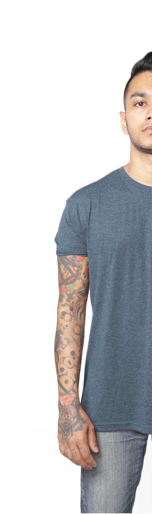
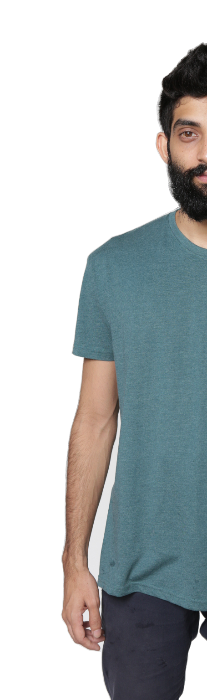

==TO DO LIST==

HOME: (1) Figure out colour scheme for pictures.
	  (2) Finish up mobile edition
	  (3) Address 
	  (4) Phone Number 
	  
GALLERY: Remove Google Drive embed
STORE/BUY: Map + Contact + Google Form
LOOOKBOOK: 6 pictures upload
ABOUT: Store needs 

==WINTER 2017 COLOUR==

#444444 --> Coal             
#444444 --> Burgundy
#444444 --> Kush
#444444 --> Flu
#444444 --> Steel-your-girl
#444444 --> Not-white

About Us
STORE (Colours pages x 6 = ) --> HOW TO ORDER (CALL TO ACTION) goes to Contact Us Page
CONTACT US

Home / animated left right gallery + small bio at the bottom and nav at top

Store Contact <!--- NAV

About US Page
===========================
HOME (3 animations) 
1. About picture
2. Store picture
3. Contact picture
============================

==QUOTE==

Our deepest fear is not that we are inadequate. 
Our deepest fear is that we are powerful beyond measure. 
It is our light, not our darkness that most frightens us. 
We ask ourselves, Who am I to be brilliant, gorgeous, talented, fabulous? 
Actually, who are you not to be? You are a child of God. 
Your playing small does not serve the world. 
There is nothing enlightened about shrinking so that other people won't feel insecure around you. 
We are all meant to shine, as children do. 
And as we let our own light shine, we unconsciously give other people permission to do the same. 
As we are liberated from our own fear, our presence automatically liberates others. 

- Marianne Williamson

==TEMPLATE==

Thanks for downloading this theme!

Theme Name: Bell
Theme URL: https://bootstrapmade.com/bell-free-bootstrap-4-template/
Author: BootstrapMade.com
Author URL: https://bootstrapmade.com

	  <!-- Mobile version 
	  

	  
	  <!-- /Mobile version--> 
	   

<!-- Gallery -->
	  <section class="portfolio" id="portfolio">
		

		  

			<!-- [X][ ][ ][ ][ ][ ] -->
			

			 
<h6>Coal</h6>

			  

				<a href="lookbook.html">
				  

					

					  

					    Sizes 
					  

					  <h6 class="card-title">S</h6>
					  <h5 class="card-title">M</h5> 
					  <h4 class="card-title">L</h4> 
					  <h3 class="card-title">XL</h3>
					  <h2 class="card-title">XXL</h2>
					  

					    LKR 1,300 
					  

					

				  
</a>
			  

			

			<!-- [ ][X][ ][ ][ ][ ] -->
			

			
<h6>Burgundy</h6>

			  

				<a href="lookbook.html">
				  

					

					    

					    Sizes 
					  

					  <h6 class="card-title">S</h6>
					  <h5 class="card-title">M</h5> 
					  <h4 class="card-title">L</h4> 
					  <h3 class="card-title">XL</h3>
					  <h2 class="card-title">XXL</h2>
					  

					    LKR 1,300 
					  

					

				  
</a>
			  

			

			<!-- [ ][ ][X][ ][ ][ ] -->
			

			
<h6>Kush</h6>

			  

				<a href="lookbook.html">
				  

					

					    

					    Sizes 
					  

					  <h6 class="card-title">S</h6>
					  <h5 class="card-title">M</h5> 
					  <h4 class="card-title">L</h4> 
					  <h3 class="card-title">XL</h3>
					  <h2 class="card-title">XXL</h2>
					  

					    LKR 1,300 
					  

					

				  
</a>
			  

			

			<!-- [ ][ ][ ][X][ ][ ] -->
			

			
<h6>Flu</h6>

			  
<a href="lookbook.html">
				  

					

					  

					    Sizes 
					  

					  <h6 class="card-title">S</h6>
					  <h5 class="card-title">M</h5> 
					  <h4 class="card-title">L</h4> 
					  <h3 class="card-title">XL</h3>
					  <h2 class="card-title">XXL</h2>
					  

					    LKR 1,300 
					  

					

				  
</a>
			  

			

			<!-- [ ][ ][ ][ ][X][ ] -->
			

			
<h6>Steel-your-girl<h6>

			  

				<a href="lookbook.html">
				  

					

					    

					    Sizes 
					  

					  <h6 class="card-title">S</h6>
					  <h5 class="card-title">M</h5> 
					  <h4 class="card-title">L</h4> 
					  <h3 class="card-title">XL</h3>
					  <h2 class="card-title">XXL</h2>
					  

					    LKR 1,300 
					  

					

				  
</a>
			  

			

			<!-- [ ][ ][ ][ ][ ][X] -->
			

			
<h6>Not-white</h6>

			  

				<a href="lookbook.html">
				  

					

					    

					    Sizes 
					  

					  <h6 class="card-title">S</h6>
					  <h5 class="card-title">M</h5> 
					  <h4 class="card-title">L</h4> 
					  <h3 class="card-title">XL</h3>
					  <h2 class="card-title">XXL</h2>
					  

					    LKR 1,300 
					  

					

				  
</a>
			  

			

		  

		

	  </section>
	  <!-- /Gallery -->

